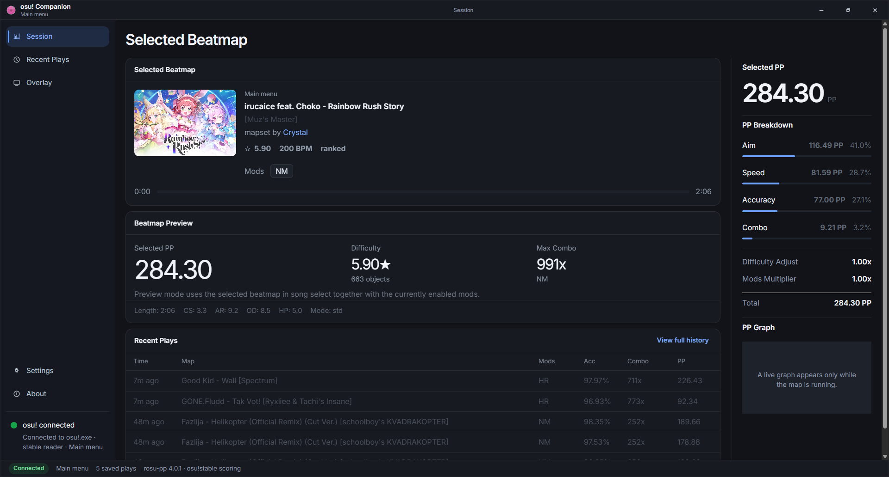

# osu! Companion

Desktop companion for osu!stable with live PP tracking, recent play history, and an in-game configurable overlay.

[Website and latest download](https://absolute2007.github.io/osuwapp/)



## Features

- Live PP, accuracy, combo, hit counts, and map context from `osu!.exe`.
- Preview PP while browsing beatmaps in song select.
- Recent play history saved between launches.
- In-game overlay editor with separate blocks for PP, stats, hits, and map text.
- Automatic reconnect after osu! is restarted.

## Stack

- React 19 + Vite for the interface
- Tauri 2 for the Windows desktop shell
- `rosu-memory-lib` for reading `osu!.exe`
- `rosu-pp` for PP calculation
- `asdf-overlay` for fullscreen in-game overlay rendering

## Windows Build Commands

This project includes local wrappers that boot Visual Studio's developer environment before running Rust or Tauri commands. Use these from a normal PowerShell prompt:

```powershell
npm install
npm run tauri:dev
```

Production build:

```powershell
npm run tauri:build
```

Rust-side compile check:

```powershell
npm run cargo:check:win
```

## Notes

- Live memory reading currently targets `osu!.exe` (stable).
- If the game is not running, the UI opens in a waiting state.
- If Visual Studio C++ tools are installed in a different location, update the paths in [scripts/Invoke-VsDevCommand.ps1](scripts/Invoke-VsDevCommand.ps1) and [scripts/Set-VsDevEnvironment.ps1](scripts/Set-VsDevEnvironment.ps1).
